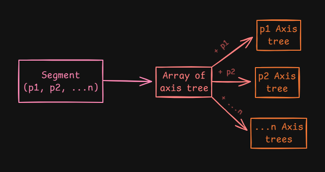
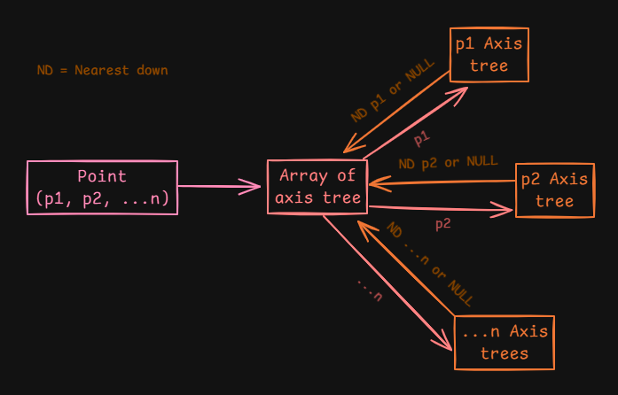
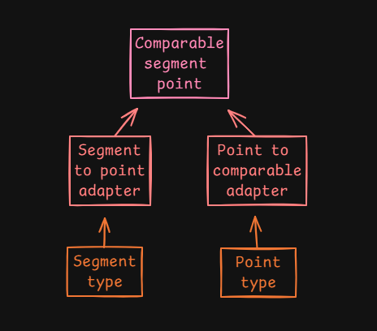

### Summary

A spatial search tree (kinda) for searching a segment in a point. The segments do not
intersect each other, like terrains.

### How it works

This data structure works by an axis-by-axis finding, where each coordinate of the point
is used to find the nearest down coordinate in the existing segments. When all axis
correspond to a valid segment, a binary search is performed to find the segment that
belongs to that point.

#### 1. Axes tree

Each one of the coordinate of the segment is located in their own axis binary tree. There is
no problem with duplicates, as long as the tree just serves as a coordinate finder more
than a unique collection.

#### 2. Axis-by-axis finding

Now, by having all the axes in their own one dimensional tree, an axis tree iteration
will take place searching for the nearest down coordinate for each point axis. If any of
the axes does not belong to any down coordinate, null (none segment) is returned.

#### 3. Comparable segment point

As long as the implementation is built in a way that either segment or segment point are
interchangeable, there is a need of an external comparable that can adapt those values in
the BST where the search of the segment is performed. This comparable is provided by
the *AxisContext*.

#### 4. Point matching

After the finding and collection of the nearest down axes, they are mapped to a comparable segment point to
perform the last search to find the segment that matches them. At this point, this operation will never return
**null**, since all the axes were found before.
Last but no least, if a point is out-of-range, i.e. outside the segment, just return nothing as well.
Pass the segment otherwise.

### Complexity
Operations and their complexity. 
- **n** = number of elements 
- **k** = number of axes.

**Add**: *O(k * log(n))* 
**Search**: *O(k * log(n))* 
**Remove**: *O(k * log(n))* 

**Space complexity**: *O(k * n)*

### Notes
Illustrations were done in [Excalidraw](https://excalidraw.com).